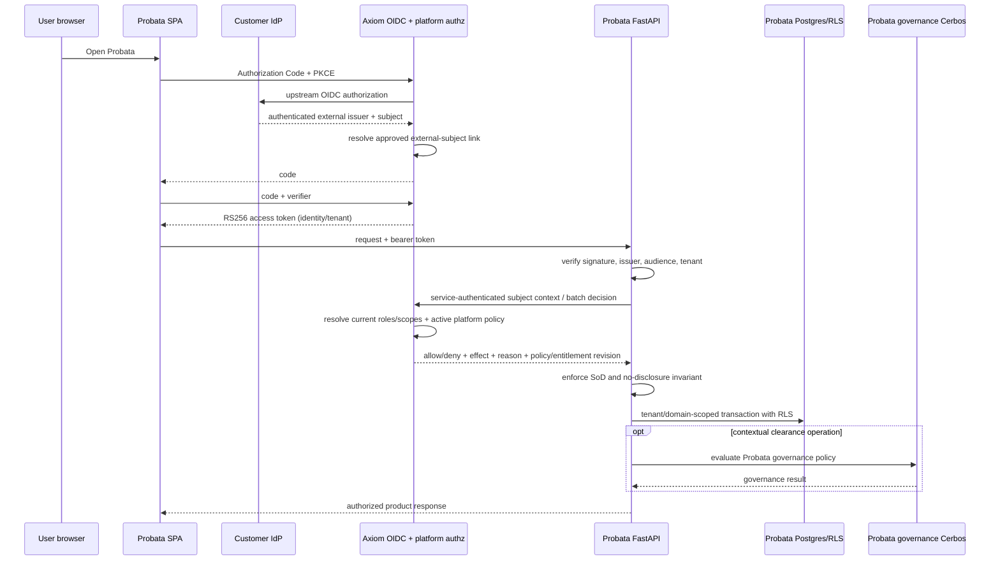

# 02 — Target Architecture and Contracts

## 1. Locked responsibility split

| Question | Authority |
|---|---|
| Who is this human or service? | customer IdP/Axiom identity |
| What tenant, roles, domains and platform grants does the subject hold now? | Axiom live directory |
| May this subject perform this Probata product action on this resource? | Axiom platform policy decision |
| Is the resource visible and how must hidden objects be represented? | Axiom decision plus Probata no-disclosure invariant |
| May the same person approve their own proposal/certification? | Probata domain SoD, with Axiom defense-in-depth |
| What makes an Agent eligible for a Use Case? | Probata-authored governance policy |
| Is an Agent cleared for this Deployment × Use Case? | Probata decision engine + Probata governance Cerbos |
| What evidence and attestation support that decision? | Probata |

The word “policy” is never enough to identify a plane. APIs, code, configuration, telemetry and UI must
say `platform authorization policy` or `agent governance policy`.

## 2. Target flow



## 3. Trust boundaries

### 3.1 Browser

- uses OIDC Authorization Code with PKCE;
- treats Axiom as the single Probata-facing issuer; Axiom brokers the configured customer IdP;
- registers `probata-spa` as a public client with no client secret, requires S256 PKCE and disables
  password/client-credentials grants for that client;
- never sends a password to Probata in production;
- stores the PKCE verifier only for the active redirect;
- does not use `localStorage` for access or refresh tokens;
- handles expiry, sign-out, callback errors and Axiom outage explicitly; and
- derives navigation from server-returned capabilities, not decoded JWT entitlements.

The current password-proxy login remains available only under an explicit demo/test flag and must be
disabled by production startup validation.

### 3.1.1 Issuer and federation topology

Production supports one topology in this program:

```text
Okta / Entra / Ping (upstream workforce IdP)
        → Axiom OIDC federation and approved subject link
        → Axiom access token (`iss` = stable Axiom issuer, `sub` = Axiom principal ID)
        → Probata
```

Probata never accepts an upstream customer-IdP token directly. Axiom keys an external identity by the
pair `(upstream_issuer, upstream_subject)` and links it to exactly one tenant-bound Axiom principal.
Link creation/change is an audited administrative operation. Unknown, inactive, duplicate, cross-tenant
or unapproved links deny. Email is display/recovery data, never the linking key. Just-in-time login may
not create a tenant, role, domain or default grant.

### 3.2 Probata edge

The edge verifies:

- `alg=RS256` only;
- signature against cached JWKS with safe rotation;
- exact issuer;
- base and tenant-qualified audience;
- `exp`, `iat`, `sub`, `tenant_id`;
- configured deployment tenant equals token tenant; and
- delegation/impersonation token types are accepted only by explicitly authorized administrative flows.

Validated JWT claims authenticate a subject. They do not grant a Probata action.
The exact issuer is Axiom's externally stable issuer; Axiom, not Probata, validates the upstream
customer-IdP issuer/JWKS and federation response.

### 3.3 Probata → Axiom service authentication

Probata calls Axiom with its own client-credentials identity or mTLS identity. It never forwards a human
bearer token as the service credential. The request carries the verified human `sub`, tenant and
correlation context as data.

The `probata-api` service client is durably registered in Axiom's production client repository, survives
restart, is bound to exactly one deployment tenant, and receives an access token with audience
`axiom-platform-authz`. Endpoints enforce the following scopes server-side:

| Scope | Permitted operation |
|---|---|
| `platform-authz:subject-context:read` | read live context for a subject in the client's tenant |
| `platform-authz:decisions:execute` | request platform decisions for that subject/tenant |
| `platform-authz:metadata:read` | read health, source and contract compatibility metadata |

The client receives no administration, role-assignment, policy-authoring, delegation or token-minting
scope. A human browser token and a service token with the wrong audience, scope or tenant are rejected.

Probata derives `tenant_id` and `subject_id` directly from immutable `VerifiedIdentity`; routers cannot
accept either as caller-controlled authorization fields. A bounded authentication context containing
issuer, authentication time and a one-way token/JTI fingerprint accompanies the call for correlation,
but Axiom never treats those descriptive fields as entitlements. Axiom binds the request tenant to both
the service-client registration and the subject's home tenant.

### 3.4 Separate policy runtimes

```text
Axiom platform-policy store/PDP
  resources: Probata screens/actions/domain objects
  subject: human/service identity and live Axiom entitlements

Probata governance-policy store/Cerbos
  resources: Agent/Deployment/Use Case/evidence decision inputs
  subject: governance decision context
```

Separate service names, credentials, storage, ports, bundles, audit fields and dashboards are mandatory.

## 4. Principal contract

Probata evolves `Principal` to distinguish authenticated identity from live authorization context:

```python
class Principal(BaseModel):
    subject_id: str
    tenant_id: str
    email: str
    display_name: str
    authentication_method: Literal["oidc", "demo_password", "api_key"]
    token_id: str | None
    is_service_account: bool

    # Populated from a live Axiom subject-context response or the local API-key store,
    # never trusted from bearer-token entitlement claims.
    roles: frozenset[str]
    domains: frozenset[str]
    permissions: frozenset[str]
    use_case_scopes: frozenset[str]
    entitlement_revision: str | None
```

Human construction is two-stage:

```text
VerifiedIdentity(sub, tenant, email, token metadata)
        +
LiveSubjectContext(roles, domains, revision)
        =
Principal
```

During shadow mode, token-carried and live contexts may both be recorded as hashes for parity. Raw
entitlement lists must not enter high-cardinality telemetry.

## 5. Axiom subject-context API

### 5.1 Endpoint

```http
POST /api/v1/platform-authz/subject-context
Authorization: Bearer <Probata service credential>
Content-Type: application/json
```

Request:

```json
{
  "contract_version": "1.0",
  "request_id": "trace-or-request-id",
  "tenant_id": "bank-a",
  "subject_id": "axiom-principal-id",
  "authentication_context": {
    "issuer": "https://axiom.bank-a.example",
    "authenticated_at": "2026-07-23T11:55:00Z",
    "token_fingerprint": "sha256:bounded-value"
  }
}
```

Response:

```json
{
  "contract_version": "1.0",
  "request_id": "trace-or-request-id",
  "tenant_id": "bank-a",
  "subject_id": "axiom-principal-id",
  "active": true,
  "roles": ["steward"],
  "domains": ["banking"],
  "attributes": {
    "classification": "confidential"
  },
  "entitlement_revision": "principal-revision-or-content-hash",
  "resolved_at": "2026-07-23T12:00:00Z"
}
```

Rules:

- tenant is mandatory and must match the subject's home tenant;
- unknown, inactive, malformed or cross-tenant subjects fail closed;
- only attributes on a product-owned allowlist are returned;
- the revision changes whenever an effective role/domain/attribute grant changes;
- no password, credential hash, personal-resource list, secret or raw policy is returned; and
- the call is audited as a service read without logging sensitive attributes.

## 6. Axiom platform-decision API

### 6.1 Endpoint

```http
POST /api/v1/platform-authz/decisions
Authorization: Bearer <Probata service credential>
Content-Type: application/json
```

The endpoint is batch-first so list/search/navigation paths do not make N remote calls.

Request:

```json
{
  "contract_version": "1.0",
  "request_id": "trace-id",
  "tenant_id": "bank-a",
  "subject_id": "axiom-principal-id",
  "decisions": [
    {
      "decision_key": "nav:discover",
      "permission": "discover",
      "resource": {
        "kind": "probata_navigation",
        "id": "discover",
        "domain": null,
        "owner_subject_id": null,
        "attributes": {}
      },
      "context": {
        "purpose": "render_navigation"
      }
    },
    {
      "decision_key": "agent:b1:retire",
      "permission": "retire",
      "resource": {
        "kind": "agent",
        "id": "b1",
        "domain": "banking",
        "owner_subject_id": "builder-123",
        "attributes": {
          "lifecycle": "active"
        }
      },
      "context": {
        "purpose": "api_request"
      }
    }
  ]
}
```

Response:

```json
{
  "contract_version": "1.0",
  "request_id": "trace-id",
  "tenant_id": "bank-a",
  "subject_id": "axiom-principal-id",
  "entitlement_revision": "e-42",
  "policy_bundle_id": "b_platform_20260723_01",
  "evaluated_at": "2026-07-23T12:00:00Z",
  "results": [
    {
      "decision_key": "nav:discover",
      "outcome": "permit",
      "allowed": true,
      "effect": "read",
      "reason_codes": ["role_read", "tenant_match"],
      "call_id": "ax-call-1"
    },
    {
      "decision_key": "agent:b1:retire",
      "outcome": "deny",
      "allowed": false,
      "effect": "deny",
      "reason_codes": ["owner_or_admin_required"],
      "call_id": "ax-call-2"
    }
  ]
}
```

### 6.2 Decision vocabulary

The contract preserves Probata's effect vocabulary while making completion authority explicit:

| Effect | Outcome | `allowed` | Meaning |
|---|---|---:|---|
| `allow` | `permit` | true | action permitted without additional scope behavior |
| `read` | `permit` | true | read-only action permitted |
| `scoped` | `permit` | true | action permitted only after the declared resource/domain scope matched |
| `cosign` | `require_cosign` | false | caller may enter the independent approval workflow but cannot complete the protected action |
| `deny` | `deny` | false | action denied |

`allowed` is true only for `outcome=permit` and the three permit effects. Probata branches on `outcome`,
not on the boolean alone; `require_cosign` routes to the existing stateful Probata workflow/SoD check. A
response with an inconsistent outcome/effect/boolean, unknown effect, missing result, duplicated
`decision_key`, mismatched tenant/subject, or unrecognized policy version is treated as deny by Probata.

Both endpoints require `Content-Type`/`Accept:
application/vnd.probata.platform-authz.v1+json`. The body `contract_version` is an additional
cross-language assertion, not a substitute for media-type negotiation. Unsupported versions return a
non-disclosing `406` or `415`; Probata treats the exchange as authorization unavailable and never retries
against a different version silently.

### 6.3 Authoritative inputs

Axiom resolves roles, domains and other entitlements from its live store using `subject_id`. Probata does
not send caller-supplied roles or permissions. Resource facts remain Probata-owned and are allowlisted by
resource kind.

Each resource kind has a versioned schema. Unknown attributes are rejected; they are not silently ignored.
Sensitive evidence, prompts, responses, connector secrets and raw policy content are never authorization
attributes.

### 6.4 Audit

Every batch emits:

- Axiom call ID per decision;
- request/trace ID;
- tenant and pseudonymous subject reference;
- permission/resource kind/resource ID hash where disclosure requires it;
- allow/deny/effect/reason codes;
- entitlement revision and platform policy bundle;
- latency/outage state; and
- service client identity.

Probata's application audit records the Axiom call ID and policy bundle for consequential actions. The two
records must be joinable without duplicating protected content.

## 7. Probata authorization port

The target port is asynchronous and resource-neutral:

```python
class PlatformAuthorizationPort(Protocol):
    async def decide(
        self,
        principal: Principal,
        permission: str,
        resource: AuthorizationResource,
        *,
        purpose: AuthorizationPurpose,
    ) -> AuthorizationDecision: ...

    async def decide_batch(
        self,
        principal: Principal,
        requests: Sequence[AuthorizationRequest],
    ) -> Sequence[AuthorizationDecision]: ...
```

`AuthorizationResource` carries:

- kind;
- stable product key or opaque ID;
- tenant;
- optional business domain;
- optional owner subject;
- an allowlisted typed attribute map; and
- a disclosure classification controlling logs/errors.

The domain remains pure. HTTP, retries, Redis and metrics live in adapters.

## 8. Adapter modes

`UAC_PLATFORM_AUTHZ_PROVIDER` has exactly these modes:

| Mode | Authority | Use |
|---|---|---|
| `code` | CodeMatrix | current/test rollback |
| `axiom_shadow` | CodeMatrix; Axiom observed only | parity and performance proof |
| `axiom` | Axiom | production target |

Rules:

- `axiom_shadow` may never change a response or grant.
- `axiom` may never use CodeMatrix to grant when Axiom denies, times out or is malformed.
- CodeMatrix remains a test oracle and shadow comparator, not a second production authority.
- a mismatch emits bounded telemetry and a durable diagnostic record without exposing hidden objects.
- the mode is deployment configuration, not a caller header.

## 9. Cache and invalidation

An authorization cache is optional until measured need is proven. If enabled:

```text
key =
  tenant
  + subject
  + entitlement_revision
  + policy_bundle_id
  + contract_version
  + permission
  + canonical resource fingerprint
  + canonical authorization-context fingerprint
```

- maximum TTL: 60 seconds;
- deny may be cached no longer than allow;
- no stale-if-error grant;
- revocation/role/policy changes publish `axiom.entitlements.changed.v1` or
  `axiom.platform-policy.activated.v1`;
- invalidation removes affected subject/policy keys;
- event loss is bounded by TTL; and
- the response/audit exposes whether a decision came from cache.

### 9.1 Invalidation event contract

Both events use one envelope:

```json
{
  "event_id": "uuid",
  "event_type": "axiom.entitlements.changed.v1",
  "occurred_at": "2026-07-23T12:00:00Z",
  "tenant_id": "bank-a",
  "aggregate_id": "axiom-principal-id",
  "aggregate_sequence": 43,
  "entitlement_revision": "e-43",
  "policy_bundle_id": null,
  "source_revision": "accepted-axiom-commit",
  "contract_version": "1.0"
}
```

Policy activation sets `aggregate_id` to the platform-policy namespace, increments its sequence and
populates `policy_bundle_id`. Events are written atomically with the entitlement/policy change to an Axiom
transactional outbox. A transport-neutral relay supports an authenticated Probata push adapter and a
cursor-based pull/replay adapter; Kafka/Redpanda is optional and cannot change semantics. Delivery is
at-least-once. Probata validates contract/source/tenant, deduplicates `event_id`, rejects sequence
regression, detects gaps, and uses the replay cursor to repair them. Malformed, wrong-tenant or
unauthenticated events never evict another tenant's keys and raise an alert. Event loss remains bounded by
the cache TTL even while replay is repaired.

## 10. SoD and no-disclosure

Axiom answers platform permission. Probata still enforces stateful product invariants that require local
transactional truth:

- proposer cannot approve their own item;
- certifier cannot certify their own Agent/use submission;
- admin setup does not imply certification authority;
- a fork cannot exceed its parent;
- stale revision cannot be approved;
- hidden objects return 404 without identity/count leakage; and
- RLS applies even after authorization allowed.

Axiom may repeat these rules for defense-in-depth, but Probata cannot delegate away the invariant.

## 11. Policy lifecycle

Axiom Policy Studio is used for Probata **platform authorization bundles**:

```text
base ceiling
  → author candidate
  → deterministic validation and compile
  → consequence diff against representative Probata resources
  → independent approval
  → immutable bundle
  → atomic activation
  → invalidation event
```

The initial bundle is generated from Probata's current permission vocabulary and CodeMatrix golden
dataset, then made human-readable and versioned. It includes no agent-clearance thresholds, evidence
requirements or governance-policy content.

### 11.1 Portable Policy Studio grounding

The pinned Axiom Studio engine is reusable, but its current production grounding adapter reads Conduit
registry/domain/agent manifests. Probata must not import that registry to make Studio start.

AXM introduces a generic `StudioGroundingProvider` deployment choice:

```text
Conduit deployment:
  ManifestBackedStudioGroundingProvider → Conduit registry manifests

Probata deployment:
  PlatformContractStudioGroundingProvider
      → frozen AXM authorization resource/action vocabulary
      → approved Axiom role/domain/tenant catalogue
      → active immutable Axiom platform-policy ceiling
      → deterministic representative authorization fixtures
```

The Probata provider reads versioned JSON/contracts mounted into Axiom; it does not import Python
modules or call the Probata database. Missing, stale, hash-mismatched or unknown vocabulary fails Studio
readiness and blocks policy generation/promotion. The grounding snapshot, contract hash and source
references are bound into every consequence review and promoted bundle.

### 11.2 Axiom Admin product mode

The imported Admin UI runs in `probata-platform` product mode:

- its API base is Axiom `iam-service`, not Conduit gateway;
- routes are limited to Dashboard, Users, Teams/Groups, Roles, Policy Studio and Audit;
- the default Studio resource is selected from the server-provided platform vocabulary, never hardcoded
  to `agent`;
- Conduit gateway, registry, agent invocation, relationship and insights vocabulary is absent;
- `probata-spa` credentials are never reused by the admin console;
- the admin console has its own public S256-PKCE client and exact redirect URI; and
- all visible authoring language says “platform access policy,” never Probata governance/clearance policy.

The source-sync manifest records the upstream files plus a small Probata product-mode patch ledger so a
future upstream refresh cannot silently reintroduce excluded routes, defaults or API dependencies.

## 12. Frontend contract

The frontend receives:

- `/api/auth/config`: OIDC issuer, client ID, redirect URI, enabled mode and safe display name;
- `/api/auth/me`: authenticated identity and live subject-context projection;
- `/api/me/capabilities`: Axiom-backed platform capability effects;
- structured `401 session_expired`;
- structured `503 identity_unavailable` or `503 authorization_unavailable`; and
- a safe correlation ID for support.

The SPA never decodes a token to decide visibility.
