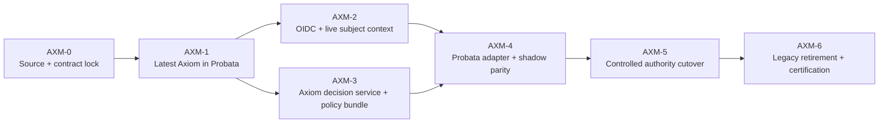

# 03 — Work Orders and Dependency DAG

## 1. Delivery policy

AXM is a production-hardening program across two repositories. It does not reopen or renumber the GRG
checkpoints. Current Probata behavior remains demoable after every checkpoint.

One integrator owns:

- public contracts;
- Axiom source pin;
- database/runtime composition;
- authorization-mode flags;
- migration ledger;
- cross-repository version pairing;
- full harness; and
- final user handoff.

Parallel workers may own disjoint modules after contracts freeze. They do not independently change
permission semantics, migration ordering, token rules or cutover authority.

## 2. Dependency graph

AXM-2 frontend work and AXM-3 Axiom decision-service work may proceed in parallel after AXM-1 proves the
source and OIDC contract. AXM-5 cannot begin until AXM-4 produces zero unexplained mismatches.

The separate GOVPOL workstream in `06-policy-realization.md` makes Probata's Enterprise →
Business-line → Use-case governance controls immutable, deployable and decision-provable. GOVPOL-0 may
be reviewed beside AXM-1, but runtime implementation begins only after AXM-1 closes. It never changes
the AXM platform-policy authority sequence.

## 3. AXM-0 — Source and contract lock

**Outcome:** every implementation session uses the same source pin, current-state evidence, typed
contracts, golden authorization corpus and rollback owner.

| Story | Deliverable | Depends on |
|---|---|---|
| AXM-001 | `axiom/UPSTREAM-SOURCE.json` source/tree pin and import allowlist | none |
| AXM-002 | current-vs-target component disposition and compatibility report | none |
| AXM-003 | normalized authorization resource/action vocabulary | none |
| AXM-004 | subject-context, batch-decision and invalidation contracts | 003 |
| AXM-005 | CodeMatrix golden authorization dataset generator and frozen baseline | 003 |
| AXM-006 | current login/authz/no-disclosure/outage baseline evidence | 002, 005 |
| AXM-007 | cross-repository version-pairing and release ledger | 001, 004 |

### AXM-0 implementation notes

- Generate the golden corpus from the current `MATRIX`, supported personas, permissions and representative
  resource/domain/ownership conditions. Do not hand-copy expected decisions.
- Include negative cases: unknown permission, empty role, cross-domain target, other owner, inactive
  subject, wrong tenant, hidden agent, M2M human-only action and SoD.
- Hash the corpus and check it into Probata as a contract fixture.
- Record every current route/gate and assign a normalized resource kind; architecture CI fails when a new
  gate is missing a disposition.
- No runtime behavior changes.

### AXM-0 close

- source and contract files are reviewed;
- golden corpus is deterministic;
- no current route is unclassified;
- baseline focused and full harness results are recorded;
- user approves the contract before service or port implementation.

## 4. AXM-1 — Adopt the latest Axiom safely

**Outcome:** Probata runs the pinned current Axiom source with stable keys and OAuth persistence while
keeping current CodeMatrix authorization.

| Story | Deliverable | Depends on |
|---|---|---|
| AXM-101 | multi-component source/tree manifest, file allowlists and reproducible sync check | AXM-001 |
| AXM-102 | refresh `axiom/` service source, Maven, Docker, tests and migrations from pin | 101 |
| AXM-103 | import `axiom-admin/` and exact curated `axiom-platform-policy/`; remove legacy Conduit APIs/pages; preserve Probata overlays | 101, 102 |
| AXM-104 | Axiom Redis OAuth store with unique DB/prefix and health checks | 102 |
| AXM-105 | persistent signing key from secret/volume; stable `kid` restart proof | 102 |
| AXM-106 | durably register public/no-secret/S256-only `probata-spa` and `axiom-admin`, plus confidential tenant-bound `probata-api`, audiences, scopes and redirects | 102, 103 |
| AXM-107 | V1–V14 disposition, seed-free fresh database and supported API/service provisioning | 102, 103 |
| AXM-108 | replace Conduit registry grounding with versioned platform-contract grounding; start isolated platform Cerbos/Axiom Admin and smoke identity/Studio/audit | 103–107 |
| AXM-109 | old/new identity-role-domain comparison and login compatibility | 104–108 |
| AXM-110 | Java/UI/Cerbos/import-manifest gates plus Probata Axiom identity gate | 109 |

### Required design choices

- Build from source in Docker; do not copy a local `target/*.jar`.
- Build `axiom-admin` from source; do not import `dist/` or `node_modules`.
- Import only the reviewed Axiom platform-policy allowlist. Conduit agent/relationship/insights and
  Probata governance policies cannot enter this runtime.
- The `probata-platform` source/profile contains no legacy policy controller/service, relationship/book
  API, Admin `Policies` page or Gateway/Registry/Agent/Insights route.
- Pin Java 25 and all base images by documented version. Never use `latest`.
- Axiom Postgres, Redis keyspace, policy runtime and signing-key volume are isolated from Probata stores.
- Set issuer to the externally stable URL identifier and use separate internal URLs for service traffic.
- Use `probata-api` and `probata-spa` naming; do not depend on `conduit-gateway` compatibility.
- Give `axiom-admin` its own public S256-PKCE client and product mode; never share a browser secret or
  silently call Conduit gateway.
- Bind Studio generation/review/promotion to the exact AXM platform contract hash and active platform
  ceiling; do not mount or synthesize a Conduit registry.
- Do not reuse an old Axiom database until Flyway checksum compatibility is proven. The reference
  deployment may replace only its Axiom demo volume under the documented reset path; customer data
  requires blue/green migration.
- Seed through supported APIs/services. Any temporary direct-database exception is named, bounded,
  tested, removed by AXM-6 and never used for customer data.
- Before provisioning, a fresh migrated database must contain zero demo/default/Meridian identities,
  grants, agents, relationship/book rows or demo bundles.

### AXM-1 close

- same persona signs in through the refreshed Axiom;
- the separate Axiom Admin opens and its identity/Policy Studio/platform-policy/audit routes work;
- imported platform Cerbos policies compile and their invariant suites pass;
- token validates before and after Axiom restart;
- roles/domains compare to the approved fixture;
- Redis outage, JWKS rotation and bad issuer/audience fail closed;
- CodeMatrix remains the only platform-decision authority;
- existing Probata governance decisions and GRG tests are unchanged.

## 5. AXM-2 — Production OIDC and live subject context

**Outcome:** browser authentication is standards-based and Probata constructs human principals from live
Axiom context rather than JWT entitlements.

| Story | Deliverable | Depends on |
|---|---|---|
| AXM-201 | Axiom subject-context endpoint and restricted service client | AXM-110 |
| AXM-202 | subject revision and allowlisted role/domain/attribute projection | 201 |
| AXM-203 | Probata verified-identity type and exact tenant binding | 201 |
| AXM-204 | Axiom subject-context adapter, timeout/error telemetry and fake | 202, 203 |
| AXM-205 | shadow compare JWT hints vs live context; no authority change | 204 |
| AXM-206 | SPA Authorization Code + PKCE initiation/callback/logout/session expiry | AXM-106 |
| AXM-207 | demo-only password proxy flag and production startup rejection | 206 |
| AXM-208 | `/me` and capability hydration session states | 204, 206 |
| AXM-209 | Axiom upstream customer-IdP federation and exact external-subject linking | 202, 206 |
| AXM-210 | identity/browser/federation/rotation/revocation/outage E2E | 205–209 |

### Invariants

- token `tenant_id` must equal configured deployment tenant and live subject tenant;
- inactive or missing subject is not authenticated for product access;
- role/domain changes are visible through a new subject revision without token renewal;
- token-carried entitlements are comparison data only;
- local identity cannot start under production configuration;
- callback state/nonce/verifier are validated and one-time;
- redirect URIs are exact allowlisted values; and
- `probata-spa` is a public client with no secret and S256 PKCE is mandatory;
- Probata trusts only the stable Axiom issuer; Axiom validates the configured upstream customer IdP;
- external identities link by `(issuer, subject)`, never email, with no JIT default grant; and
- user-facing failures do not disclose subjects, tenants or policy internals.

### AXM-2 close

Log in through Axiom, change one persona's domain assignment using an authorized Axiom operation, refresh
Probata, and show that `/me` reflects the live assignment without accepting the stale token claim.
Platform action decisions are still CodeMatrix-backed until AXM-5.

## 6. AXM-3 — Axiom platform-decision service and policy bundle

**Outcome:** Axiom can make complete, live, audited Probata platform decisions without importing Probata
governance semantics.

| Story | Deliverable | Depends on |
|---|---|---|
| AXM-301 | generic batch-decision API module in upstream Axiom | AXM-004, AXM-110 |
| AXM-302 | strict service audience/scope enforcement and tenant/VerifiedIdentity subject binding | 301 |
| AXM-303 | resource-schema registry and unknown-attribute rejection | AXM-003, 301 |
| AXM-304 | batch evaluator over active Axiom platform policy runtime | 302, 303 |
| AXM-305 | complete effect/reason/policy/entitlement revision response | 304 |
| AXM-306 | audit/correlation/decision-log persistence and redaction | 305 |
| AXM-307 | initial Probata platform bundle generated from golden corpus | AXM-005, 304 |
| AXM-308 | Policy Studio consequence review, independent approval and activation | 307 |
| AXM-309 | transactional entitlement/policy invalidation outbox, push/pull adapters and replay | 306, 308 |
| AXM-310 | upstream API/OpenAPI/contract/security/outage tests | 301–309 |
| AXM-311 | pin the accepted upstream Axiom commit into Probata | 310 |

### Policy requirements

- one explicit result for every submitted decision key;
- default deny for unknown subject/action/resource/policy input;
- child/domain policies only narrow the enterprise ceiling;
- CodeMatrix effects have a documented representation;
- no wildcard role/action grants;
- resource kinds and attributes are versioned;
- policy activation is immutable, approved and atomic;
- self-approval and stale approval fail;
- policy rollback is a new reviewed activation, not pointer tampering; and
- decision logs include the exact active bundle and call ID.

### AXM-3 close

The live Axiom endpoint evaluates the golden corpus with no unexplained result, produces an examiner-ready
audit chain and survives malformed/cross-tenant/unknown/outage tests. It is still non-authoritative in
Probata.

## 7. AXM-4 — Probata adapter and shadow parity

**Outcome:** every Probata authorization gate has an Axiom shadow decision, measured without changing
product behavior.

| Story | Deliverable | Depends on |
|---|---|---|
| AXM-401 | async `PlatformAuthorizationPort`, typed request/resource/decision domain | AXM-004 |
| AXM-402 | async CodeMatrix adapter preserving the frozen oracle | 401 |
| AXM-403 | Axiom HTTP adapter, client credentials, deadlines and response validation | AXM-311, 401 |
| AXM-404 | request-scoped/batch authorization coordinator | 402, 403 |
| AXM-405 | migrate route/service gates to typed resources | 404 |
| AXM-406 | architecture test forbidding direct `authz.authorize`/untyped decisions | 405 |
| AXM-407 | shadow comparator, bounded diagnostics and parity dashboard | 404, 405 |
| AXM-408 | optional revision-aware Redis cache and invalidation consumer | AXM-309, 403 |
| AXM-409 | full golden/persona/resource/no-disclosure/outage/load parity gate | 406–408 |
| AXM-410 | signed zero-unexplained-divergence report | 409 |

### Migration order inside AXM-405

1. navigation and capability hydration;
2. pure read/list routes;
3. resource reads/no-disclosure routes;
4. ordinary mutations;
5. workflow decisions and certification;
6. administration, audit/WORM and API-key management.

Each slice keeps CodeMatrix authoritative and records Axiom shadow results. Shared helper functions cannot
hide an untyped resource or make one remote call per row.

### AXM-4 close

- 100% gate inventory coverage;
- zero unexplained decision divergence on the golden corpus and live representative traffic;
- no N+1 decision pattern;
- measured p95 latency and cache behavior within the written envelope;
- Axiom outage leaves CodeMatrix behavior unchanged only because this is shadow mode; and
- governance clearance parity remains unchanged.

## 8. AXM-5 — Controlled authority cutover

**Outcome:** Axiom becomes the one platform-authorization authority, by route family, with explicit
rollback and no grant fallback.

| Story | Deliverable | Depends on |
|---|---|---|
| AXM-501 | cutover manifest listing every route family and rollback owner | AXM-410 |
| AXM-502 | read/navigation authority cutover | 501 |
| AXM-503 | resource/no-disclosure authority cutover | 502 |
| AXM-504 | ordinary write authority cutover | 503 |
| AXM-505 | workflow/certification/admin authority cutover | 504 |
| AXM-506 | Axiom outage/degraded UX and operational response | 502 |
| AXM-507 | entitlement/policy-change propagation and revocation SLO proof | 505 |
| AXM-508 | complete persona, RLS, SoD, audit and rollback rehearsal | 502–507 |

CodeMatrix continues to compute a mirror result for parity telemetry but cannot affect the HTTP response.
An unavailable, malformed or incomplete Axiom decision denies. There is no “temporarily use local grant”
branch.

### AXM-5 close

All route families show `provider=axiom`, full harness is green, user/persona demos pass, policy and
entitlement changes propagate within the declared SLO, and an outage produces no grant.

## 9. AXM-6 — Legacy retirement and certification

**Outcome:** transitional paths cannot accidentally return to production and the migration is
operator/auditor ready.

| Story | Deliverable | Depends on |
|---|---|---|
| AXM-601 | production startup rejects local identity, demo password and code authority | AXM-508 |
| AXM-602 | retire legacy Meridian mapping after observed-zero compatibility window | 601 |
| AXM-603 | remove direct-DB provisioning exception and generated/binary source artifacts | 601 |
| AXM-604 | secret custody, rotation, backup/restore and DR runbooks | AXM-105, 508 |
| AXM-605 | dashboards/SLOs/alerts for OIDC, subject context, decisions and invalidation | 508 |
| AXM-606 | SBOM/signature/source-pin/export evidence | 603, 604 |
| AXM-607 | independent security/architecture critic and remediation | 601–606 |
| AXM-608 | final from-zero reset, live demo, rollback and user acceptance | 607 |

The local provider and CodeMatrix remain available to hermetic unit/contract tests. They are not selectable
under a production configuration.

## 10. Program Definition of Done

- newest approved Axiom source is pinned and reproducibly imported;
- real OIDC/PKCE works with persistent keys and rotation;
- live subject context, not JWT entitlements, constructs human authorization context;
- Axiom evaluates every Probata platform action;
- all gates carry typed resource context;
- CodeMatrix is a non-authoritative parity oracle;
- zero unexplained parity gaps;
- no Axiom failure grants;
- resource no-disclosure, RLS and Probata SoD remain intact;
- Probata governance Cerbos/clearance/attestation behavior is unchanged;
- platform policy has independent review, immutable versions and audit reconstruction;
- demo/test identity and direct-DB bootstrap cannot run in production;
- full Python, Java, API contract, Postgres/RLS, Playwright/a11y, outage/restart/load/rollback and reset
  gates pass; and
- the user completes and accepts the live access-loop demonstration.
