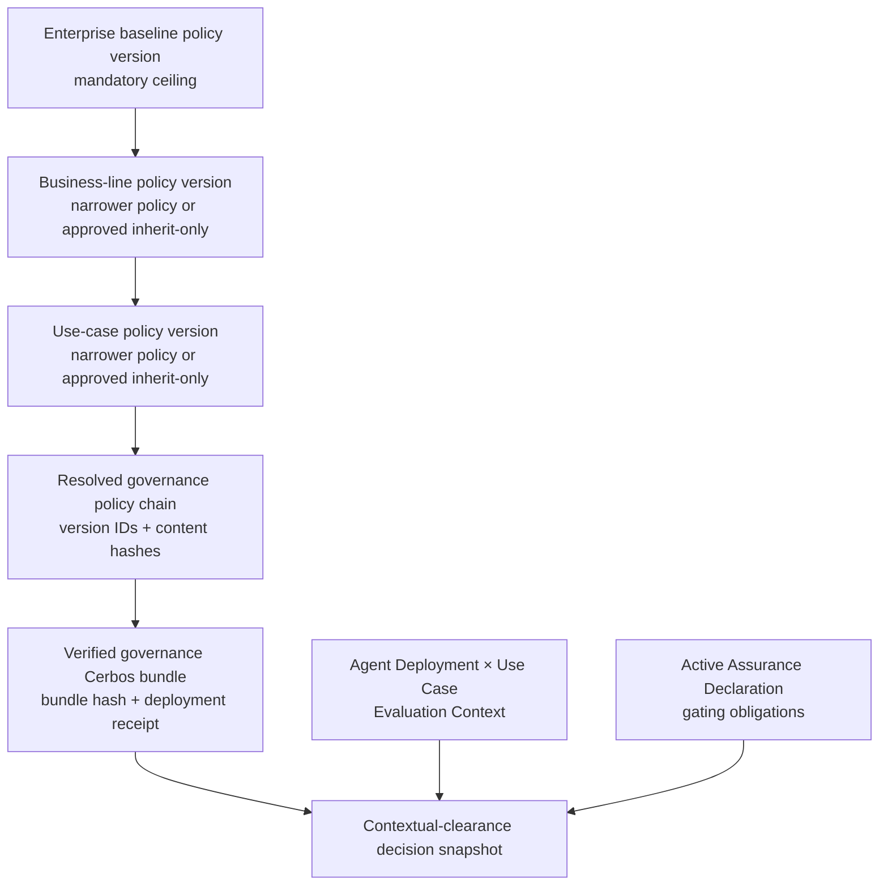

# 06 — Policy Realization: Platform Access and Agent Governance

**Status:** Approved implementation contract; GOVPOL runtime opens only after AXM-1 certification  
**Decision owner:** Product Owner + Solution Architect + Security + UX  
**Implementation authority:** Product Owner approval recorded 2026-07-24; execute GOVPOL-101 through
GOVPOL-406 in dependency order after AXM-110 is independently certified  
**Purpose:** make both policy planes operationally real without mixing their semantics or runtimes

## 0. Authorization record

The Product Owner explicitly requires Enterprise, Business-line and Use-case policy controls to be
operationally real. Approval does not waive any acceptance gate in this document and does not authorize
mixing Axiom platform authorization with Probata agent governance. AXM-1 remains the immediate
integration gate; GOVPOL runtime implementation begins after its certification so two workstreams do
not mutate the same migrations and deployment composition concurrently.

## 1. The product promise

Probata must never show a policy merely because a YAML file, seed record or attractive screen exists.
A policy is real only when its exact immutable version has been:

1. authored against a versioned resource/action or governance-control contract;
2. reviewed with its inherited consequence visible;
3. approved by an independent authorized subject;
4. compiled and validated;
5. deployed to the correct isolated policy runtime;
6. verified by a deployment receipt and live probe;
7. selected by an auditable active pointer; and
8. pinned into every decision or attestation that relied on it.

There are two such systems. They share lifecycle ideas, not policy content, stores, PDPs or authority.

| Policy plane | Question answered | Authoring owner | Runtime | Decision consumer |
|---|---|---|---|---|
| Axiom platform authorization | May this subject view, manage, approve or administer this Probata resource? | Axiom Policy Studio | Axiom platform-policy Cerbos | Probata platform authorization adapter |
| Probata agent governance | Is this Agent Deployment eligible for this Use Case under the applicable enterprise, business-line and use-case controls? | Probata Govern | Probata governance Cerbos | Probata contextual-clearance resolver |

The UI, APIs, audit records, metrics and operational alerts must always use the qualified terms
**platform authorization policy** and **agent governance policy**.

## 2. Current truth and gaps

This section records the July 2026 implementation truth. It is not the target architecture.

| Area | Current truth | Required closure |
|---|---|---|
| Platform decision authority | `get_authz()` returns `CodeMatrixAdapter`; Probata platform access is still decided by the in-process role matrix. | AXM-3 through AXM-5 must introduce, shadow and deliberately cut over the Axiom decision authority. |
| Vendored Axiom policy | The legacy `Policy` entity and service persist YAML and mutate one row through draft/approved/deployed. | AXM-1 excludes that legacy path. AXM-3 supplies immutable platform bundles, independent approval, active revisions and audited rollback. |
| Governance lifecycle | Probata supports draft → review → approved → deployed → retired with author/approver separation. | Preserve the behavior while replacing mutable-in-place authority with immutable versions and an explicit active pointer. |
| Governance deployment | `PolicyAuthoringService` can write a generated policy through `AdminApiPolicyStore` before it marks the aggregate deployed. | Replace the cross-system gap with desired state, transactional outbox, idempotent deployment worker, receipt, probe and activation state machine. |
| Governance hierarchy | Cerbos parental-consent scope rules narrow allows across Enterprise → Business-line → Use-case. | Validate the effective child consequence against its parent; do not treat the `is_loosen` permission check as semantic proof. |
| Missing layer | Cerbos can fall back to a parent. Probata explanation reconstruction expects one deployed policy at each layer and can become unavailable. | Make every required layer explicit: an active policy version or an independently approved `inherit_only` version. Absence is not a policy. |
| Flagship explanations | Five seeded use cases prefer static `USE_CASE_CONTROLS`; imported compatibility rows mirror hand-written Cerbos policy. | Remove static/runtime mirror authority after migration. Every explanation must resolve from the exact active policy chain and verified bundle. |
| Decision provenance | The boolean is returned by Cerbos, while Probata reconstructs policy explanation/version locally. | A decision snapshot must pin the exact resolved version chain, bundle hash, input hash and PDP result. |
| Lifecycle evidence | Deploy/retire and approve/reject have partial audit/outbox coverage. | Every consequential mutation, including create and submit, writes state + audit + outbox atomically. |
| Assurance | Assurance Declarations, obligations and Evaluation Context exist as separate durable objects, but obligation satisfaction is not yet part of clearance. | Join policy eligibility and gating obligation satisfaction in the contextual-clearance resolver without putting evidence scores inside policy. |
| UI | Imported-policy detail is mostly honest, but some Govern copy implies deployment alone produces clearance. | Show desired/deployed/verified/active truth, inherited effective controls, evidence obligations and exact decision provenance separately. |

Current evidence is traceable in:

- `backend/app/api/deps.py` (`get_authz`, `get_policy_authoring_service`);
- `backend/app/domain/policy.py`;
- `backend/app/services/policy_authoring.py`;
- `backend/app/services/eligibility.py`;
- `backend/app/domain/use_case_controls.py`;
- `backend/app/adapters/policy/admin_api.py`;
- `backend/app/db/models/policy.py`;
- `backend/app/db/models/assurance_declaration.py`;
- `backend/app/db/models/evaluation_context.py`; and
- `frontend/src/app/pages/PolicyDetailPage/PolicyDetailPage.tsx`.

## 3. Canonical hierarchy



Rules:

1. Exactly one active Enterprise baseline version exists for the deployment.
2. Each active Business Line has exactly one active governance-policy version or one active,
   independently approved `inherit_only` version.
3. Each active Use Case has exactly one active governance-policy version or one active, independently
   approved `inherit_only` version.
4. `inherit_only` is a real immutable version with author, approver, reason and activation history. It is
   never inferred from a missing row.
5. A child version cannot widen its parent. A requested relaxation is a separate governed exception
   object and is out of the initial realization scope; it cannot be hidden in ordinary policy YAML.
6. Retirement activates a separately reviewed replacement or `inherit_only` version. It never silently
   deletes the active layer.
7. Enterprise policy is the ceiling, Business-line policy specializes the domain, and Use-case policy
   specializes the declared purpose. Agent-, deployment- and environment-specific facts are evaluation
   inputs, not additional mutable policy layers.

### 3.1 Closed control algebra and comparison universe

GOVPOL v1 is deliberately closed and deny-oriented. An implementation may not invent an alternative
meaning for “narrower.”

`GovernanceControlVocabularyVersion` pins:

- the exact governed Agent-attribute and governed resource/context-attribute schema versions;
- one typed namespace for each attribute, including unit, enum/domain, numeric bounds and missing-value
  behavior;
- the supported operators `not`, `eq`, `ne`, `lt`, `lte`, `gt`, `gte` and `not_in`;
- exact, case-sensitive string/enum and exact decimal numeric comparison semantics;
- a single `deny` effect; ordinary child policy cannot author `allow`, remove, override or precedence;
- disjunction inside a layer: any firing local predicate denies; and
- conjunction across the hierarchy, represented as a union of denial sets.

For a typed decision input `x`:

```text
D(version) = normalized set of inputs denied by that local version
D(chain)   = D(enterprise) ∪ D(business_line) ∪ D(use_case)
A(chain)   = U − D(chain)
```

`U` is the versioned decision-input universe defined by the pinned attribute schemas. Missing,
unmapped, invalid-unit and unverifiable values occupy explicit input states and deny whenever a
referenced mandatory control cannot be evaluated; an unknown namespace or operator is invalid policy,
not “not fired.”

Therefore:

- a child is structurally non-widening only if the compiled chain retains every parent predicate and
  adds zero `allow`/override construct;
- `inherit_only` has an empty local denial set and produces exactly the parent decision vector;
- a candidate chain widens its parent if any `x ∈ U` is parent-denied and candidate-allowed;
- a replacement is a tightening when `A(new) ⊆ A(current)`;
- a replacement is a relaxation when some input changes deny → allow relative to the current active
  chain. It requires an explicit relaxation change class, additional independent co-sign and rationale,
  while still remaining inside the parent ceiling; and
- any requested exception that would override the parent ceiling is rejected in GOVPOL v1.

The comparison implementation normalizes booleans/enums to finite sets, numbers to exact interval
unions and strings to exact/cofinite sets. Unsupported or non-normalizable predicates fail authoring.
Any future AND/nesting, custom CEL, wildcard, allow/override or new operator requires a new vocabulary
version and migration review.

Each candidate also produces a deterministic `PolicyComparisonCorpusVersion`, hashed from:

- all approved authored golden cases;
- every referenced attribute's missing/invalid state;
- every boolean and enum value;
- numeric minimum/maximum and each threshold at below/equal/above boundaries using the attribute's
  declared precision;
- string/list member, non-member and unknown values; and
- every parent/current/candidate predicate and resolved scope.

The normalized set/interval algebra is the authority for non-widening. The corpus proves Python/compiler/
live-Cerbos parity and renders the exact allow→deny and deny→allow consequence diff; it is not a sampled
substitute for the algebra.

### 3.2 GRG policy-reference disposition

GOVPOL v1 has exactly three mutable governance-policy layers: **Enterprise → Business Line → Use Case**.
The target of each layer is the canonical stable resource identifier from the scope graph. Environment,
jurisdiction, residency, deployment and regional references in the existing Governed Resource Graph (GRG)
are not a fourth policy hierarchy. They are typed Evaluation Context inputs or typed control facts whose
schema/version is pinned by the policy version and whose values are captured in the decision snapshot.

- Historical GRG references remain provenance and may be displayed, but they cannot select a mutable
  governance-policy version after the GOVPOL cutover.
- A new mutable policy reference at any other scope is rejected as `ambiguous_policy_path`. A future layer
  requires an explicitly versioned product decision and a new vocabulary/migration review.
- A control may evaluate a contextual fact, but that fact does not change the Enterprise, Business Line or
  Use Case parent vector. Missing or unverifiable mandatory facts deny as defined in §3.1.
- This disposition governs only Probata Enterprise governance. It neither changes GRG assurance ownership
  nor makes the fact an Axiom platform-policy decision.

## 4. Canonical governance objects

| Object | Mutability | Purpose |
|---|---|---|
| `GovernancePolicyDefinition` | stable identity | names the plane, scope kind and scope target |
| `GovernancePolicyVersion` | immutable | exact source, normalized controls, parent-version reference, author and content hash |
| `GovernancePolicyReview` | append-only | reviewer disposition against an exact version hash |
| `GovernancePolicyApproval` | append-only | independent approval; stale hash and self-approval deny |
| `GovernancePolicyBundle` | immutable | deterministically compiled Enterprise + Business-line + Use-case material |
| `PolicyDeploymentIntent` | append-only state transitions | desired deployment of one exact bundle to one runtime |
| `PolicyDeploymentReceipt` | append-only | runtime, bundle hash, external revision, probe result, timestamps and correlation |
| `GovernancePolicyActivation` | append-only/current pointer | selects one verified bundle and resolved version chain |
| `GovernancePolicyDecisionSnapshot` | immutable | pins context, inputs, active activation, PDP result and explanation |

The current mutable `Policy` table remains a compatibility read model during migration. It cannot remain
the long-term decision authority.

The normative lifecycle, deployment, legacy-retirement and public-boundary contract is
[07-govpol-implementation-contract.md](07-govpol-implementation-contract.md). Per-story executable
acceptance is [08-govpol-acceptance-matrix.md](08-govpol-acceptance-matrix.md).

## 5. Authoring, deployment and activation

```text
draft immutable candidate
  → submit exact version hash
  → consequence review against exact active parent
  → independent approval
  → deterministic compile and lint
  → state + audit + deployment-intent outbox commit
  → idempotent worker deploys to Probata governance Cerbos
  → live probe verifies external revision and bundle hash
  → deployment receipt persists
  → activation selects the verified bundle
  → decisions pin the activation and resolved version chain
```

Required behavior:

- Editing an approved or deployed policy creates a new version.
- Compilation is deterministic: equal ordered inputs produce the same bundle hash.
- A deployment error leaves the preceding activation authoritative.
- A receipt may never be fabricated from a successful HTTP status alone; the live probe verifies the
  expected policy/bundle identity.
- Reconciliation compares desired activation, deployment receipt and live runtime state.
- Drift marks the policy runtime degraded, prevents new clearance from claiming a verified chain and
  starts replay/redeployment. It never falls back to static controls.
- Rollback is a new independently reviewed activation of a previously verified immutable bundle.
- Platform-policy and governance-policy workers use different stores, credentials, namespaces,
  readiness probes and audit event types.
- No public GOVPOL mutation is reachable until the shared transactional state + audit + deployment-intent
  outbox envelope in GOVPOL-202 is available. No lifecycle path invokes Cerbos before its PostgreSQL
  transaction commits.

## 6. Contextual clearance and assurance

The Assurance Declaration, Measurement taxonomy, Connector evidence, obligation satisfaction,
Certification Attestation and contextual roll-up remain owned by:

- `docs/Capability and Governed Resource Graph/04-high-level-design.md`;
- `docs/Capability and Governed Resource Graph/05-low-level-design.md`; and
- GRG-311/312, GRG-508–514 and GRG-608–611 in the checkpoint specifications.

This workstream supplies a provable governance-policy input to those existing objects and stories. It
does not create a second declaration, obligation, evidence, decision, attestation or consequence model.

Policy eligibility and evidence assurance are separate inputs to one contextual decision:

```text
clearance =
  evaluation_context_is_current
  AND governance_policy_allows
  AND every_applicable_gating_obligation_is_satisfied
  AND no_blocking_staleness_or_drift
```

The agent-governance policy declares controls. The Use Case owns its one effective Assurance Declaration,
which composes exact policy/control requirements into testable obligations and preserves their source
traceability. Policy does not contain Langfuse scores, connector payloads or mutable evidence results.

The Assurance Declaration defines the exact build-time and continuous obligations for the Use Case.
Measurement Definitions map agent-specific scores into the product measurement families. Connector
receipts, evidence observations and obligation-satisfaction records prove the results. The clearance
snapshot pins:

- Agent, Agent Version, Agent Deployment and Environment versions;
- Use Case and Evaluation Context version;
- Enterprise, Business-line and Use-case governance-policy versions;
- governance bundle and activation hash;
- Assurance Declaration version;
- applicable obligation and Measurement Definition versions;
- accepted evidence observation/receipt identities and freshness state;
- PDP request/result hashes; and
- the final reason code and timestamp.

A policy allow with a failed, stale, missing or not-evaluated mandatory gating obligation is **not
cleared**. A non-gating measurement remains visible as assurance information but does not change the
boolean clearance result.

## 7. Product UX

### 7.1 Axiom Admin

Axiom Admin owns:

- identity, role, scope and tenant administration;
- platform-access Policy Studio;
- platform-policy review, approval, deployment and activation;
- platform-decision and administrative audit.

It must never show Probata clearance, evidence scores or agent-governance authoring.

### 7.2 Probata Govern

Probata owns a first-class **Governance Policies** journey:

1. hierarchy view: Enterprise → Business Line → Use Case;
2. selected version and lifecycle state at every layer;
3. explicit `inherit_only`, missing, drifted and unverified states;
4. effective-controls diff showing inherited, added and forbidden-widening changes;
5. Assurance Declaration link and build-time/continuous obligation summary;
6. deployment timeline: desired → deployed → verified → active;
7. exact runtime/bundle/receipt without exposing credentials or raw sensitive policy;
8. decision drill-down from Agent Deployment × Use Case to the pinned policy and evidence chain; and
9. accessible loading, empty, denied, degraded, stale and conflict states.

Copy must not say “deployed” when only a database row exists, or “cleared” when only policy eligibility
has passed.

## 8. Work orders

### GOVPOL-0 — Contract and migration lock

| Story | Deliverable | Depends on |
|---|---|---|
| GOVPOL-001 | current static, compatibility, authored and live-Cerbos authority ledger | AXM-0 |
| GOVPOL-002 | versioned schemas/contracts for the closed control vocabulary/comparison corpus plus definition, version, review, approval, bundle, intent, receipt, activation and decision snapshot | 001 |
| GOVPOL-003 | exact scope graph, parent pin and required-layer/`inherit_only` semantics | 002 |
| GOVPOL-004 | migration/backfill/rollback plan for current mutable and imported compatibility policies | 001–003 |
| GOVPOL-005 | public API, permission, audit-event and no-disclosure contract | 002–004 |

### GOVPOL-1 — Immutable authoring and hierarchy

| Story | Deliverable | Depends on |
|---|---|---|
| GOVPOL-101 | immutable policy definition/version persistence, RLS and current read model; mutations remain unreachable | GOVPOL-005, AXM-110 |
| GOVPOL-102 | submit/review/reject/approve state machine with stale-hash and SoD enforcement | 101 |
| GOVPOL-103 | deterministic parent resolver, exact parent-vector equality proof and effective-control model | 102 |
| GOVPOL-104 | normalized set/interval narrowing validator, generated comparison corpus, compiler/PDP parity and forbidden-widening/relaxation explanations | 103 |
| GOVPOL-105 | explicit independently approved `inherit_only` lifecycle, including equality proof | 102–104 |
| GOVPOL-106 | migrate seeded/static controls through supported service/API paths | 105, GOVPOL-202 |
| GOVPOL-107 | one-way cutover: remove static controls and imported compatibility rows from runtime authority only after verified activation | 106, GOVPOL-205 |

### GOVPOL-2 — Bundle deployment and operational truth

| Story | Deliverable | Depends on |
|---|---|---|
| GOVPOL-201 | deterministic isolated governance-bundle assembler and hash | GOVPOL-104, 105 |
| GOVPOL-202 | shared transactional state + audit + deployment-intent outbox envelope, then public lifecycle mutations | GOVPOL-102, 201 |
| GOVPOL-203 | leased idempotent deployment worker and exact runtime credentials/namespace | 202 |
| GOVPOL-204 | live bundle probe and append-only deployment receipt | 203 |
| GOVPOL-205 | verified activation pointer and preceding-activation preservation on failure | 204 |
| GOVPOL-206 | drift reconciler, replay, alert and independently approved rollback activation | 205 |

### GOVPOL-3 — Clearance and assurance join

| Story | Deliverable | Depends on |
|---|---|---|
| GOVPOL-301 | policy resolver returns exact active Enterprise/Business-line/Use-case version chain only after one-way authority cutover | GOVPOL-107, GOVPOL-205 |
| GOVPOL-302 | extend the existing GRG decision snapshot with exact policy request/result/bundle/activation hashes | 301, GRG-511 |
| GOVPOL-303 | wire the resolved policy chain into the existing Evaluation Context + active Assurance Declaration roll-up | 302, GRG-510 |
| GOVPOL-304 | prove the existing GRG gating-obligation, staleness, drift and not-evaluated consequences against the new exact policy input | 303, GRG-511, GRG-608–611 |
| GOVPOL-305 | extend the existing GRG Certification Attestation reconstruction with the exact policy activation/version chain | 304, GRG-512 |
| GOVPOL-306 | emit policy-activation impact into the existing selective re-certification flow; do not create a second consequence engine | 305, GRG-601–611 |

### GOVPOL-4 — UX, demo and certification

| Story | Deliverable | Depends on |
|---|---|---|
| GOVPOL-401 | hierarchy and effective-controls screen | GOVPOL-105 |
| GOVPOL-402 | lifecycle/consequence review and independent approval screens | GOVPOL-102, 104, GOVPOL-202 |
| GOVPOL-403 | deployment/receipt/drift/rollback operational screen | GOVPOL-206 |
| GOVPOL-404 | Agent Deployment × Use Case policy-and-evidence decision drill-down | GOVPOL-305 |
| GOVPOL-405 | API, Postgres/RLS, Cerbos, outbox/replay, Playwright/axe and parity harness | GOVPOL-401–404 |
| GOVPOL-406 | from-zero seed/reset, exact demo clicks, audit evidence and user acceptance | GOVPOL-405 |

## 9. Ordering and safe parallelism

- AXM-1 may proceed first and must not change Probata governance behavior.
- GOVPOL-0 document/schema work may be reviewed in parallel with AXM-1 because it changes no runtime.
- GOVPOL runtime implementation starts only after **AXM-110 certification**, not merely AXM-1 code
  completion, so the shared checkout, migrations and Docker composition have one integrator.
- After GOVPOL-101 freezes the schema, the hierarchy/authoring lane and bundle-worker lane may proceed in
  parallel only where file ownership is disjoint; public mutations remain unreachable until GOVPOL-202.
- AXM-2 and AXM-3 may run in parallel with GOVPOL implementation because they operate on the Axiom
  platform plane, but one root integrator owns shared composition, public contracts and final gates.
- GOVPOL-3 depends on the Capability and Governed Resource Graph Assurance Declaration, Measurement
  Definition, Evaluation Context, evidence-obligation and attestation contracts. It cannot invent a
  second version of those objects.
- No thread may change both platform-policy semantics and governance-policy semantics in one story.

## 10. Acceptance and Definition of Done

The workstream is not complete until all of the following are demonstrated:

1. one and only one verified active Enterprise version;
2. one active policy or approved `inherit_only` version for every active Business Line and Use Case;
3. child widening rejected with an intelligible effective diff;
4. the closed vocabulary and generated comparison corpus are versioned and hashed; `inherit_only`
   equals the exact parent vector, compiler/PDP parity holds at every generated boundary, and unknown
   or non-normalizable constructs fail authoring;
5. author self-approval and stale-version approval denied and audited;
6. editing an active policy creates a new immutable version;
7. deployment failure cannot move the active pointer;
8. duplicate/reordered deployment events are idempotent;
9. database/runtime drift is detected, shown and reconciled;
10. rollback is a new approved activation with complete history;
11. every decision pins the exact version chain, bundle hash, activation and PDP result;
12. a policy allow plus failed/missing/stale mandatory obligation is not cleared;
13. no static `USE_CASE_CONTROLS` or imported compatibility record affects runtime decision authority;
14. no Axiom platform policy enters Probata governance Cerbos and no governance policy enters Axiom;
15. state + audit + outbox are atomic for every consequential lifecycle mutation;
16. tenant RLS, scope, no-disclosure and SoD negative proofs pass;
17. seed/reset uses supported API/service paths and produces no hidden authority;
18. the UI distinguishes authored, approved, deployed, verified, active, drifted and cleared;
19. unit, integration, contract/parity, Cerbos, migration, Playwright/axe and outage/replay gates pass;
20. the user can perform the exact hierarchy → review → deploy → verify → decision → evidence demo; and
21. an independent critic finds no unresolved P0/P1 before Product, Architecture, Security and UX sign.

Code, a screen, a database row or a green unit suite by itself does not satisfy this Definition of Done.
The story-sized, positive and negative evidence required for each GOVPOL-001…406 is normative in
[08-govpol-acceptance-matrix.md](08-govpol-acceptance-matrix.md).
